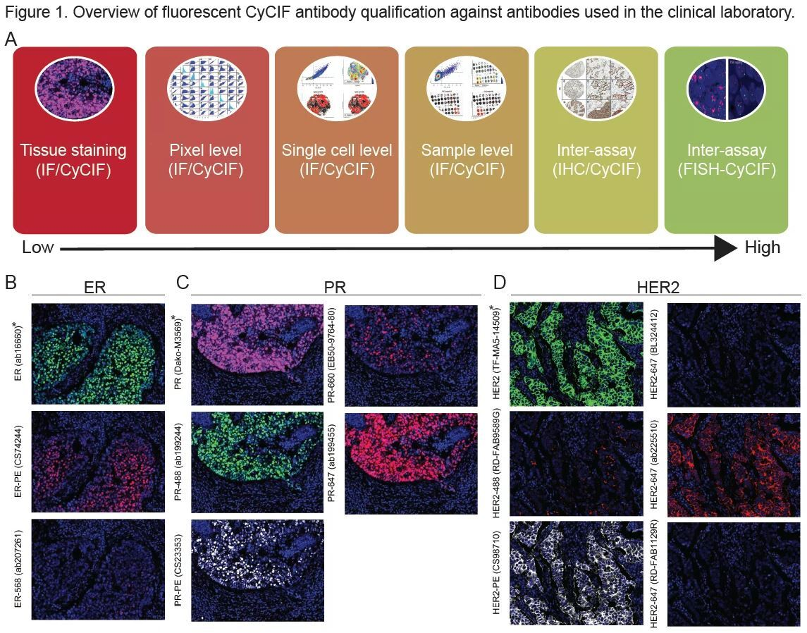

# Qualification of a multiplexed tissue imaging assay and detection of novel patterns of HER2 heterogeneity in breast cancer
 
Guerriero JL, Lin JR, Pastorello RG, Du Z, Chen YA, Townsend M, Shimada K, Hughes ME, Ren S, Tayob N, Zheng K, Mei S, Patterson A, Taneja K, Metzger O, Tolaney SM, Lin NU, Dillon DA, Schnitt SJ, Sorger PK, Mittendorf EA, Santagata S
 
 
 

## SUMMARY
Emerging data suggests that HER2 intratumoral heterogeneity (ITH) is associated with therapy resistance, highlighting the need for new strategies to assess HER2 ITH. A promising approach is leveraging multiplexed tissue analysis techniques such as cyclic immunofluorescence (CyCIF), which enable visualization and quantification of 10-60 antigens at single-cell resolution from individual tissue sections. In this study, we qualified a breast cancer specific antibody panel, including HER2, ER and PR, for multiplexed tissue imaging. We then compared the performance of these antibodies against established clinical standards using pixel-, cell- and tissue-level analyses, utilizing 866 tissue cores (representing 294 patients). To ensure reliability, the CyCIF antibodies were qualified against HER2 immunohistochemistry (IHC) and fluorescence in situ hybridization (FISH) data from the same samples. Our findings demonstrate the successful qualification of a breast cancer antibody panel for CyCIF, showing high concordance with established clinical antibodies. Subsequently, we employed the qualified antibodies, along with antibodies for CD45, CD68, PD-L1, p53, Ki67, pRB and AR to characterize 567 HER2+ invasive breast cancer samples from 189 patients. Through single-cell analysis we identified four distinct cell clusters within HER2+ breast cancer exhibiting heterogeneous HER2 expression. Furthermore, these clusters displayed variations in ER, PR, p53, AR and PD-L1 expression. To quantify the extent of heterogeneity, we calculated heterogeneity scores based on the diversity among these clusters. Our analysis revealed expression patterns that are relevant to breast cancer biology, with correlations to HER2 ITH and potential relevance to clinical outcome.

## ACCESS THE DATA
All images at full resolution, derived image data (e.g., segmentation masks), and cell count tables have been released via the Harvard Tissue Atlas (https://www.tissue-atlas.org/atlas-datasets/guerriero-lin-santagata-2023/)
 

## FUNDING
This work was supported by the Dana-Farber/Harvard Cancer Center (DF/HCC) Specialized Program of Research Excellence (SPORE) in Breast Cancer P50 CA1685404 Career Enhancement Award, The Susan G. Komen Foundation Career Catalyst Award CCR18547597, The Terri Brodeur Breast Cancer Foundation, The Ludwig Center at Harvard, NIH NCI R37-CA269499, U2C-CA233280 and U2C-CA233262, the Gray Foundation, R50-CA274277 and the Center for Cancer Systems Pharmacology NCI U54-CA225088.
 
